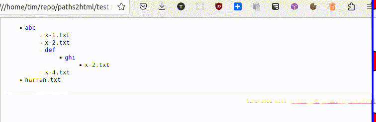

# paths2html

<https://github.com/timabell/paths2html>

License: AGPL-3.0

## About

Pipe a list of file paths to this program and it will generate an html file with the folders as clickable lists that will collapse when you click on them.

This makes it easy to take a massive file list and collapse things that you've looked at or that aren't interesting.

## Demo

It will convert this:

```
abc/x-1.txt
abc/x-2.txt
abc/def/ghi/x-2.txt
abc/x-4.txt
hurrah.txt
```

into this:



## Usage

```bash
grep "Known file not used" ~/Documents/hashdeep-checksums-verification.txt \
  | sed 's/:.*//'| paths2html \
  | tee tmp.html \
  && xdg-open tmp.html
```

## md5sum verification

I wrote this to used to be able to more quickly eyeball md5deep verification output and spot anything I care about that's gone missing.

See
<https://timwise.co.uk/2022/03/02/detecting-bit-rot-with-md5deep/> and
<https://gist.github.com/timabell/f70f34f8933b2abaf42789f8afdbd7d5>
